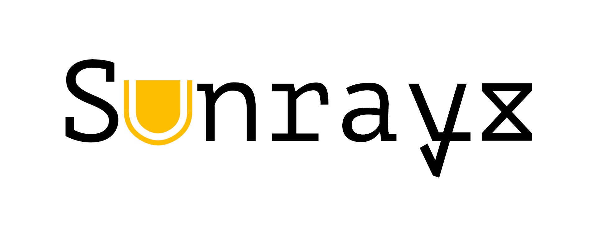

# Sunrayz
Sunrayz is a visual novel development engine, inspired by Ren'Py, Light.vn and Novelty.



# Dependencies
### Windows
- MinGW GCC 8.3.0+ (Visual Studio is not supported)
- Python 3.10.6 (may work on a lower version, but not tested)
- Windows versions of ``unix2dos`` and ``patch`` (both can be found [here](https://gnuwin32.sourceforge.net/packages.html))
- Also please double make sure that all utilities above are present in PATH.

### Linux, Haiku
- GCC 8.3.0+
- Python 3.10.6 (may work on a lower version, but not tested)
- GNU Patch

# Building
To build, enter the following in your terminal:
```
cd Sunrayz
./waf configure build install run
```
### Cleaning
To clean what you have build, type:
```
./waf clean
```
If you want to completely delete anything not source-related from the directory, type:
```
./waf purge
```
or
```
./waf distclean
```
